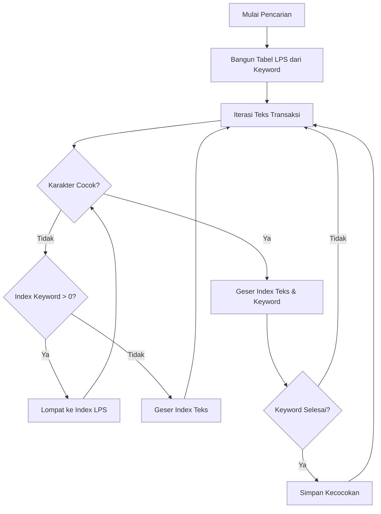
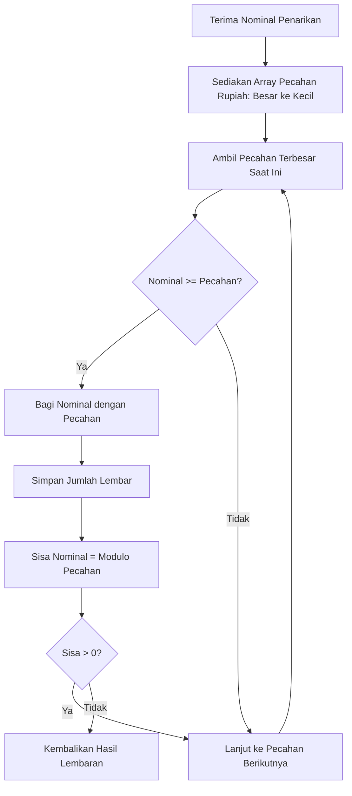
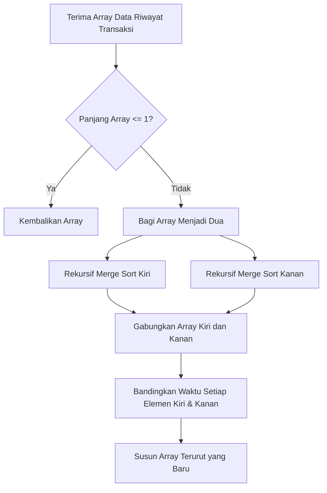
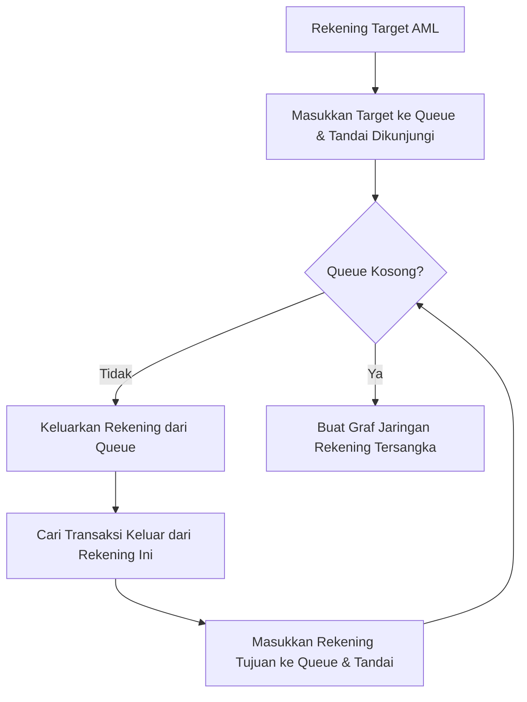
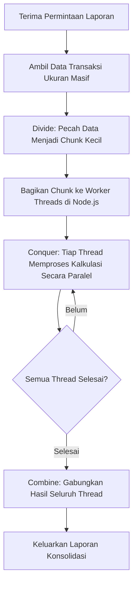

# Laporan Implementasi Algoritma pada Ekosistem SmartBank

## 1. Analisis Aplikasi
Ekosistem **SmartBank** dirancang sebagai sebuah *micro-ecosystem* perbankan terintegrasi yang memisahkan area tanggung jawab berdasarkan profil penggunanya. Pemisahan ini menciptakan spesifikasi, kebutuhan performa, serta tantangan komputasi yang sangat unik pada masing-masing modul. Berikut adalah hasil analisis mendalam untuk setiap aplikasinya:

### 1.1 Aplikasi Nasabah (Customer App)
* **Peran & Aksesibilitas:** Berfungsi sebagai antarmuka utama (*front-end*) yang diakses langsung oleh masyarakat luas melalui berbagai perangkat (ponsel cerdas, tablet, PC) dengan spesifikasi piranti keras yang sangat bervariasi.
* **Tumpukan Teknologi (Tech Stack):** Menggunakan Vanilla JavaScript yang dieksekusi secara mandiri pada peramban klien (*Client-Side Rendering*).
* **Karakteristik & Tantangan Komputasi:** Karena berjalan di sisi klien, eksekusi kode bergantung sepenuhnya pada *thread* utama (*main thread*) peramban nasabah. Tantangan terbesarnya adalah menjaga *User Experience* (UX) agar tetap mulus (*smooth*), responsif, dan ringan. Operasi pencarian pada ribuan baris riwayat mutasi harus diproses secara efisien agar antarmuka tidak mengalami *freeze* atau *lag* yang bisa mengurangi kepercayaan nasabah terhadap stabilitas aplikasi perbankan.

### 1.2 Aplikasi Teller (Teller App)
* **Peran & Aksesibilitas:** Dioperasikan secara eksklusif oleh staf internal di lingkungan kantor cabang fisik. Aplikasi ini menjadi jembatan antara perputaran uang tunai dengan pencatatan digital.
* **Tumpukan Teknologi (Tech Stack):** Dioperasikan melalui *browser* internal cabang menggunakan JavaScript berbasis web interaktif.
* **Karakteristik & Tantangan Komputasi:** Menitikberatkan pada akurasi mutlak dan integritas kronologis. Proses yang terjadi di aplikasi ini berdampak langsung pada aset kas bank dan kelancaran antrean nasabah fisik. Oleh karena itu, aplikasi membutuhkan algoritma pengurutan yang stabil (*stable sort*) untuk manajemen antrean dan cetak buku tabungan, serta algoritma matematis presisi tinggi untuk memandu staf Teller meminimalkan pengeluaran fisik jumlah lembaran uang (*cash dispenser guidance*) guna mengamankan likuiditas cabang.

### 1.3 Aplikasi Admin & Backend (System Administrator App)
* **Peran & Aksesibilitas:** Berfungsi sebagai *dashboard* pengawasan, pelaporan, dan orkestrasi logika inti (*core banking engine*) yang diakses oleh administrator sistem. Modul backend juga melayani seluruh permintaan API dari aplikasi nasabah maupun teller.
* **Tumpukan Teknologi (Tech Stack):** Menggunakan *runtime* Node.js, Express, TypeScript, dan Prisma ORM (*Server-Side Environment*).
* **Karakteristik & Tantangan Komputasi:** Harus menangani komputasi berbeban sangat masif (*heavy I/O & computation*) yang merupakan agregasi data transaksi gabungan seluruh cabang. Tantangan komputasinya meliputi pemetaan pola graf transaksi untuk mendeteksi tindak pidana pencucian uang (*Anti-Money Laundering*) serta memproses laporan tutup buku konsolidasi akhir bulan. Pendekatan komputasi biasa secara sekuensial akan mengakibatkan *memory overflow* atau membuat server gagal merespons API lain, sehingga penerapan algoritma paralelisasi sangat diwajibkan di modul ini.

---

## 2. Fungsi dan Tujuan Penerapan Algoritma pada Fitur

Berdasarkan analisa kebutuhan di atas, berikut adalah algoritma yang diterapkan beserta fungsinya:

| Aplikasi | Algoritma | Fitur | Tujuan |
| :--- | :--- | :--- | :--- |
| **Nasabah & Admin** | **Knuth-Morris-Pratt (KMP)** | *Search Bar* Riwayat Transaksi dan *Ledger* | Melakukan pencocokan string/keyword pencarian secara instan pada jutaan baris riwayat transaksi tanpa memblokir antarmuka peramban. |
| **Teller** | **Greedy Algorithm** | *Smart Cash Calculator* / Denominasi Tunai | Menghitung kombinasi lembaran pecahan uang dengan jumlah lembaran paling sedikit secara otomatis saat penarikan tunai. |
| **Teller** | **Merge Sort (Divide & Conquer)** | Cetak Buku Tabungan & Antrean | Mengurutkan transaksi berdasarkan urutan waktu (kronologis) dengan jaminan stabilitas posisi (*stable sort*). |
| **Admin/Backend** | **Breadth-First Search (BFS)** | Modul Anti-Pencucian Uang (AML) | Melacak aliran dana keluar lapis demi lapis untuk memetakan rekening-rekening penampung yang saling terhubung (Koneksi tingkat-1, tingkat-2, dst). |
| **Admin/Backend** | **Divide & Conquer (Parallel)** | Laporan Konsolidasi Akhir Bulan | Menguraikan beban *Big Data* ke dalam proses paralel (*Worker Threads*) lalu menggabungkannya, sehingga laporan besar selesai jauh lebih cepat. |

---

## 3. Pentingnya Penerapan Algoritma Tersebut

Penerapan algoritma-algoritma ini krusial untuk:
1. **Performa & Skalabilitas (KMP & Parallel D&C):** Seiring bertambahnya nasabah, jumlah transaksi akan tumbuh secara eksponensial. Jika menggunakan algoritma dasar, sistem akan *crash* karena kehabisan RAM atau mengalami perlambatan ekstrem (*UI freeze*).
2. **Akurasi & Integritas Data (Merge Sort & Greedy):** Di industri keuangan, posisi transaksi dan uang fisik tidak boleh salah hitung sedetik atau selembar pun. Algoritma spesifik memastikan kesalahan manual tereliminasi.
3. **Keamanan Finansial (BFS):** Bank dituntut mematuhi regulasi ketat. Melacak mutasi berantai menggunakan graf mencegah denda regulasi dan membekukan dana kejahatan dengan akurat.

---

## 4. Alasan Pemilihan Algoritma Tersebut

1. **KMP (Knuth-Morris-Pratt)** dipilih dibanding *Brute Force* karena kemampuannya membangun tabel *Longest Prefix Suffix* (LPS). Jika terjadi ketidakcocokan karakter, KMP tahu persis seberapa jauh harus melompat, mencapai kompleksitas $O(n+m)$ alih-alih $O(n \times m)$.
2. **Greedy** dipilih untuk kalkulator denominasi karena pecahan uang Rupiah (100rb, 50rb, 20rb, dll) bersifat *canonical*. Algoritma ini berjalan sangat cepat ($O(n)$) dengan langsung mengambil pecahan terbesar tanpa perlu komputasi *Dynamic Programming* yang lebih memakan memori.
3. **Merge Sort** dipilih dibanding Quick Sort karena sifatnya yang *Stable*. Pada data riwayat transaksi, transaksi yang terjadi pada detik yang persis sama harus dipertahankan urutan aslinya. Kompleksitasnya juga terjamin $O(n \log n)$ pada semua skenario.
4. **BFS (Breadth-First Search)** dipilih untuk kasus pelacakan (AML) karena secara alami memetakan graf dari jarak terpendek (jarak terdekat dari tersangka).
5. **Parallel Divide & Conquer** di sisi Node.js memanfaatkan *Worker Threads* untuk I/O dan CPU bound tasks, secara signifikan mengurangi waktu agregasi berhari-hari menjadi hitungan menit.

---

## 5. Referensi Jurnal Terkait

Pemilihan algoritma ini divalidasi oleh literatur akademis yang tersimpan dalam repositori dokumen proyek ini:

1. **Algoritma Knuth-Morris-Pratt (KMP)**
   - **Jurnal Terkait:** *"Abstract Keyword Searching with Knuth Morris Pratt Algorithm"* dan *"Implementasi Algoritma Knuth Morris Pratt Pada Pencarian Data Asosiasi UMKM Provinsi Bengkulu"*.
   - **Hubungan:** Jurnal-jurnal ini menjadi landasan teori implementasi KMP pada fitur pencarian riwayat transaksi Nasabah dan *Ledger* Admin. Pembahasan pada jurnal memvalidasi bahwa penggunaan tabel *prefix* (LPS) sangat menghemat memori dan mempercepat pencarian data finansial.

2. **Algoritma Greedy**
   - **Jurnal Terkait:** *"Greedy Algorithms and the Making Change Problem"* dan *"The Greedy Coin Change Problem and Its Optimality in Currency Systems"*.
   - **Hubungan:** Referensi ini menginspirasi pembuatan fitur *Smart Cash Calculator* di aplikasi Teller. Jurnal tersebut membuktikan bahwa masalah kembalian koin/pecahan (*Coin Change Problem*) pada sistem mata uang standar paling optimal diselesaikan dengan pendekatan rakus (*Greedy*).

3. **Algoritma Divide & Conquer (Merge Sort)**
   - **Jurnal Terkait:** *"Shared Memory, Message Passing, and Hybrid Merge Sorts for Standalone and Clustered SMPs"* dan *"Halstead's Complexity Measure of a Merge Sort and Modified Merge Sort Algorithms"*.
   - **Hubungan:** Digunakan pada modul Cetak Buku Tabungan dan Manajemen Antrean Teller. Jurnal ini memberikan argumen kuat mengenai performa dan kompleksitas *Merge Sort* yang konsisten di $O(n \log n)$ dan pentingnya penggunaan *stable sort*.

4. **Algoritma Breadth-First Search (BFS)**
   - **Jurnal Terkait:** *"An Exploratory Survey on the Use of Graph Algorithms in Analysis of Networks and Fraud"* dan *"Detecting Financial Fraud through Hybrid AI Models Leveraging Graph Networks and Transactional Behavior"*.
   - **Hubungan:** Algoritma graf ini merupakan nyawa dari fitur Anti-Money Laundering (AML) di sisi Admin/Backend untuk melacak sebaran aliran dana hasil kejahatan lapis demi lapis guna memetakan jaringan penipu.

5. **Algoritma Parallel Divide & Conquer**
   - **Jurnal Terkait:** *"Optimization Implementation and Performance Analysis of Divide-and-Conquer Algorithm in Big Data Sorting and Retrieval"* dan *"Divide-and-Conquer Methods for Big Data Analysis"*.
   - **Hubungan:** Melandasi teknik *Worker Threads* di Node.js untuk fitur Laporan Konsolidasi Bulanan agar server dapat mengagregasi *Big Data* transaksi secara komputasi paralel guna menghindari *memory overflow*.

---

## 6. Gambar Logika dan Flow/Alur Kerja

### A. Alur Kerja KMP (Pencarian Teks)


### B. Alur Kerja Greedy (Pecahan Tunai)


### C. Alur Kerja Merge Sort (Pengurutan Transaksi)


### D. Alur Kerja Breadth-First Search (Anti-Money Laundering)


### E. Alur Kerja Divide & Conquer (Parallel Report)


---

## 7. Pseudocode & Visualisasi (Opsional)

### A. Pseudocode KMP
```text
function KMP_Search(Text, Pattern)
    LPS <- buildLPS(Pattern)
    i <- 0, j <- 0
    while i < length(Text)
        if Pattern[j] == Text[i]
            i++, j++
        if j == length(Pattern)
            print "Found at index " + (i - j)
            j <- LPS[j - 1]
        else if i < length(Text) and Pattern[j] != Text[i]
            if j != 0
                j <- LPS[j - 1]
            else
                i++
```

### B. Pseudocode Greedy Algorithm (Coin Change)
```text
function GreedyDenomination(amount)
    denominations <- [100000, 50000, 20000, 10000, 5000, 2000, 1000]
    result <- {}
    for coin in denominations
        if amount >= coin
            count <- floor(amount / coin)
            result[coin] <- count
            amount <- amount mod coin
    return result
```

### C. Pseudocode Merge Sort
```text
function MergeSort(Array)
    if length(Array) <= 1 return Array
    mid <- length(Array) / 2
    Left <- MergeSort(Array[0..mid])
    Right <- MergeSort(Array[mid..end])
    return Merge(Left, Right)

function Merge(Left, Right)
    Result <- []
    while Left is not empty and Right is not empty
        if Left[0].time <= Right[0].time
            Result.append(Left[0]), remove Left[0]
        else
            Result.append(Right[0]), remove Right[0]
    return Result + Left + Right
```

### D. Pseudocode Breadth-First Search (BFS)
```text
function BFS_TrackMoney(Graph, StartAccount, MaxDepth)
    Queue <- []
    Visited <- Set()
    ResultNetwork <- []
    
    Queue.enqueue((StartAccount, 0))
    Visited.add(StartAccount)
    
    while Queue is not empty
        (CurrentAccount, Depth) <- Queue.dequeue()
        ResultNetwork.append(CurrentAccount)
        
        if Depth < MaxDepth
            for Neighbor in Graph.getOutgoingTransfers(CurrentAccount)
                if Neighbor not in Visited
                    Visited.add(Neighbor)
                    Queue.enqueue((Neighbor, Depth + 1))
                    
    return ResultNetwork
```

### E. Pseudocode Divide & Conquer Parallel (Worker Threads)
```text
// Main Thread
function ParallelReport(BigData)
    Chunks <- splitIntoChunks(BigData, NUM_CORES)
    CompletedThreads <- 0
    CombinedResult <- []
    
    for each chunk in Chunks
        spawn WorkerThread(chunk, onMessageCallback)
        
    function onMessageCallback(partialResult)
        CombinedResult.append(partialResult)
        CompletedThreads++
        if CompletedThreads == NUM_CORES
            return aggregateFinalReport(CombinedResult)

// Worker Thread
function WorkerProcess(chunk)
    PartialSum <- 0
    for each transaction in chunk
        PartialSum += transaction.amount
    sendToMainThread(PartialSum)
```
