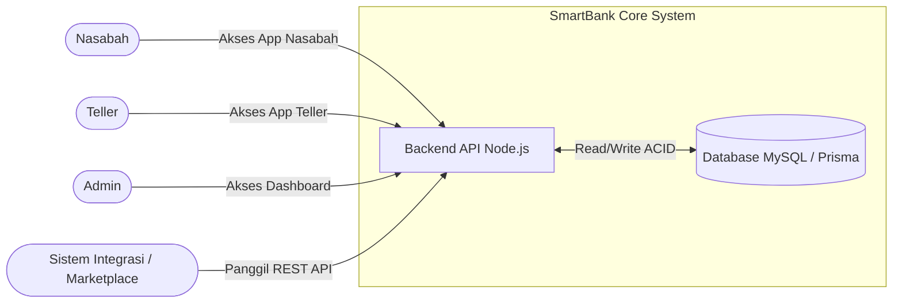
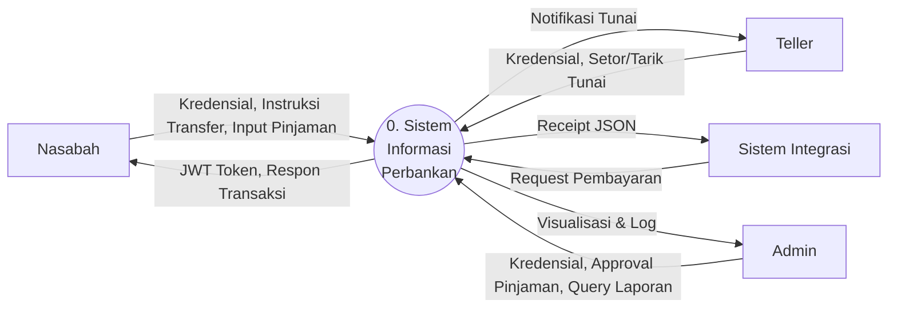
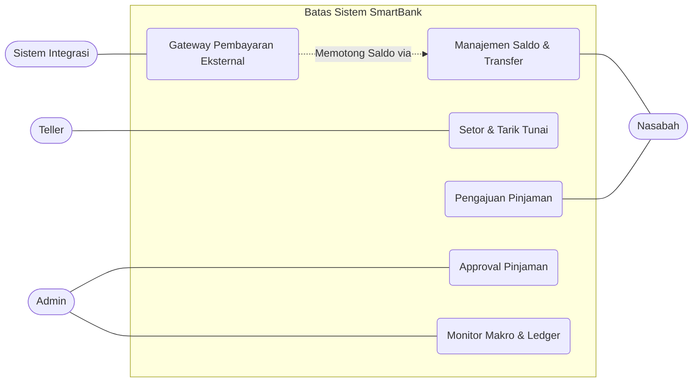

# SOFTWARE REQUIREMENTS SPECIFICATION
**Platform SmartBank (Core Banking System)**

## Atribut Metadata
| Atribut              | Nilai                                                                                                                                                                                                                                      |
| ----------------------| --------------------------------------------------------------------------------------------------------------------------------------------------------------------------------------------------------------------------------------------|
| **Nama Dokumen**     | Software Requirements Specification (SRS) SmartBank                                                                                                                                                                                        |
| **Versi**            | 1.0 - Professional Requirements Baseline                                                                                                                                                                                                   |
| **Tanggal**          | 22 Juni 2026                                                                                                                                                                                                                               |
| **Sistem**           | SmartBank (Core Banking System & Ledger)                                                                                                                                                                                                   |
| **Pemilik Produk**   | Tim Pengembang SmartBank                                                                                                                                                                                                                   |
| **Target Pembaca**   | Product owner, developer, QA engineer, maintainer, dan administrator operasional                                                                                                                                                           |
| **Basis Penyusunan** | SRS ini disusun dari dokumen PRD, DOKUMENTASI.md, serta skema database Prisma (MySQL) dan rancangan fungsional API Node.js (Express). Struktur dokumen mengikuti pola SRS profesional untuk menjamin traceability dan acceptance criteria. |

## 1. Pendahuluan dan Konteks Dokumen
### 1.1 Tujuan Dokumen
Dokumen ini mendefinisikan kebutuhan perangkat lunak untuk aplikasi SmartBank sebagai *Single Source of Truth* (sistem perbankan inti) di dalam ekosistem ekonomi virtual. SRS ini berfungsi sebagai baseline bersama antara pemilik produk dan pengembang untuk memastikan setiap fitur memiliki ruang lingkup yang jelas dan kriteria penerimaan yang dapat diverifikasi.

Selain itu, dokumen ini merinci bagaimana SmartBank mengelola pasokan uang (*money supply*), menyediakan layanan pencatatan transaksi terpusat (*ledger*), serta memfasilitasi kebutuhan perbankan secara menyeluruh dari sisi manajemen (Admin), operasional cabang (Teller), hingga pengguna ritel (Nasabah). Spesifikasi teknis dan operasional di dalam dokumen ini diharapkan dapat menjadi panduan ketat (*strict integration contract*) untuk memastikan keandalan fase integrasi sistem dengan mitra atau aplikasi pihak ketiga.

### 1.2 Ruang Lingkup Produk
SmartBank adalah inti sistem ekonomi yang bertindak sebagai otoritas utama atas seluruh mutasi saldo, transaksi tarik/setor tunai, dan pergerakan uang dalam ekosistem (Closed-Loop System). Aplikasi ini terdiri dari portal Admin, Teller, Nasabah, dan Backend API (Node.js + MySQL). Fungsionalitas mencakup manajemen saldo, transfer uang, pembayaran integrasi, kredit/pinjaman, dan pencatatan ledger.

Secara teknis, ruang lingkup aplikasi sangat bergantung pada penerapan *Double-Entry Bookkeeping* untuk menjamin akurasi buku besar (*ledger*) serta perlindungan data finansial menggunakan standar transaksi ketat. SmartBank menyediakan antarmuka pengguna yang disesuaikan untuk setiap persona (seperti *mobile-first app* untuk Nasabah dan *dashboard* pengelolaan untuk Admin/Teller), yang semuanya dihubungkan ke backend tersentralisasi. Arsitektur ini bertujuan menjaga *money supply* (meliputi agregasi cadangan dan suplai beredar) agar tidak terjadi penciptaan uang di luar prosedur yang sah.

### 1.3 Out of Scope
Meskipun bertindak sebagai sistem penyokong transaksi inti, SmartBank memiliki batasan tanggung jawab yang jelas. Sistem ini didesain secara eksklusif hanya untuk memproses aliran uang, validasi nominal, serta pengelolaan makroekonomi, sehingga operasi bisnis sektoral pada aplikasi mitra sepenuhnya diabaikan dari arsitektur SmartBank.

| Area | Status Scope | Rasional |
| --- | --- | --- |
| E-Commerce/Marketplace Catalog | Di luar scope | SmartBank murni memproses aliran uang (pembayaran) via API, bukan mengelola produk atau pesanan. |
| Pengiriman Logistik | Di luar scope | Entitas pengiriman ditangani aplikasi terpisah; SmartBank hanya memfasilitasi transaksi pembayaran terkait. |
| Otomatisasi Trading | Di luar scope | Tidak ada fitur bursa saham atau trading otomatis dalam lingkup awal sistem. |

## 2. Gambaran Produk dan Batas Sistem
### 2.1 Product Perspective
Aplikasi SmartBank menempati posisi sentral dalam arsitektur. Backend Node.js (Express) berdiri dengan database MySQL (Prisma ORM) yang menyimpan status moneter global (`system_state`), pengguna (`users`), dan buku besar (`transactions`). Semua portal frontend (Admin, Teller, Nasabah) dan aplikasi eksternal (sistem integrasi luar) harus berkomunikasi melalui REST API SmartBank.


*Gambar 1. Konteks sistem dan batas tanggung jawab SmartBank.*

### 2.2 User Classes dan Karakteristik
Sistem melayani beberapa kelas pengguna dengan hak dan ekspektasi yang berbeda. Kebutuhan sistem harus menjaga perbedaan tersebut agar fungsionalitas perbankan dan transaksi integrasi dapat dijalankan tanpa saling mengganggu.

| User Class | Tanggung Jawab | Ekspektasi Sistem | Kontrol Akses |
| --- | --- | --- | --- |
| **Nasabah** | Mengecek saldo, riwayat mutasi, transfer ke user lain, dan mengajukan pinjaman. | UI mobile-first, transaksi *real-time*, saldo konsisten. | Session JWT via login Nasabah. |
| **Teller** | Melayani setor/tarik tunai nasabah secara fisik dan transfer *walk-in*. | UI pencarian cepat, penghitungan pecahan tunai (*Greedy Algorithm*), urutan mutasi akurat (*Merge Sort*). | Session JWT via login Teller. |
| **Admin** | Memantau makroekonomi (reserve, circulating), menyetujui pinjaman, dan menarik fee. | Visualisasi data (*Chart.js*), pelacakan pencucian uang (*BFS*), dan pencarian ledger cepat (*KMP*). | Session JWT via login Admin. |
| **Sistem Integrasi** | Meminta pemrosesan pembayaran dari entitas ekosistem luar. | Kontrak API stabil, error deterministik, ACID compliance. | API Key / Token Integrasi. |

### 2.3 Operating Environment
| Komponen | Spesifikasi Saat Ini | Implikasi Requirement |
| --- | --- | --- |
| **Runtime Backend** | Node.js (Express) dengan TypeScript. | Concurrency tinggi dan type-safety pada alur transaksi. |
| **Database** | MySQL 8.0 dengan Prisma ORM. | Memastikan integritas referensial dan pembungkus transaksi (`$transaction`) untuk ACID. |
| **Frontend** | Vanilla JavaScript (SPA), HTML, CSS. | UI ringan dengan manipulasi DOM dan *fetch* asinkron. |

## 3. Konteks Operasional dan Arsitektur
### 3.1 Architectural Overview
Aplikasi menggunakan arsitektur *Client-Server* modern. Backend menyediakan RESTful API JSON. Frontend (Nasabah, Teller, Admin) terpisah dalam folder spesifik yang memanggil endpoint backend. Database MySQL menjadi satu-satunya sumber validitas saldo (Single Source of Truth) yang dilindungi oleh ORM Prisma.

| Lapisan | Artefak Utama | Tanggung Jawab |
| --- | --- | --- |
| **Routing** | Node.js Express Router (`backend/src/routes/*`) | Mengarahkan permintaan HTTP (REST API) ke controller yang sesuai. |
| **Controller** | Express Controllers (`backend/src/controllers/*`) | Mengendalikan sesi JWT, validasi akses, proses logika bisnis (transfer, pinjaman, AML), dan merespon dalam format JSON. |
| **Model** | Prisma Schema (`backend/prisma/schema.prisma`) | Mengelola query database, migrasi, relasi data, dan pembungkus `$transaction` untuk menjaga status *ACID*. |
| **View (Frontend)** | `index.html`, `script.js`, `style.css` (pada folder `admin`, `nasabah`, `teller`) | Menyajikan antarmuka pengguna SPA (Single Page Application), dasbor, form transaksi, dan visualisasi grafik *Chart.js*. |
| **Helper / Service** | Algoritma khusus (BFS, KMP, Greedy, Merge Sort) | Menjalankan logika kompleks untuk *AML tracking*, pencarian buku besar, pemecahan nilai tunai, dan pengurutan histori. |

### 3.2 Data Flow
Sistem SmartBank mengelola berbagai aliran data antara entitas eksternal, proses inti, dan penyimpanan data terpusat (*Data Stores*). Secara garis besar alur datanya meliputi:
1. **Autentikasi & Akun**: Kredensial pengguna (Nasabah, Teller, Admin) divalidasi untuk mendapatkan token JWT.
2. **Pemrosesan Transaksi**: Instruksi transfer/tunai atau request pembayaran (*Marketplace*) memicu *Double-Entry Bookkeeping* dalam blok `$transaction`. Proses ini memvalidasi kelayakan cadangan (*Reserve 98%*), memotong tarif layanan 1%, memperbarui saldo, dan mencatat riwayat mutasi (*Ledger*).
3. **Pengajuan Pinjaman**: Pengajuan dari nasabah disimpan sebagai status tertunda untuk ditinjau oleh Admin. Jika disetujui, uang akan ditransfer dari *Reserve* menjadi *Circulating Supply*.
4. **Pelaporan & Ledger**: Riwayat *immutable* pada buku besar dimanfaatkan oleh Admin untuk visualisasi data, pengecekan kelayakan pinjaman, serta penelusuran rekam jejak anti pencucian uang (AML) melalui pencarian berbasis performa (*KMP & BFS*).


*Gambar 2. Data Flow Diagram (DFD) level operasional aplikasi SmartBank.*

## 4. Domain Data dan Aturan Bisnis
### 4.1 Core Domain Entities
| Entitas | Deskripsi | Field Penting | Catatan Ownership |
| --- | --- | --- | --- |
| `SystemState` | Status moneter bank (1 row saja). | `totalSupply`, `reserve`, `circulating`, `feeAccumulated` | Hanya Admin yang bisa mengubah manual. |
| `User` | Entitas akun pengguna. | `id`, `name`, `password`, `type`, `balance`, `status` | Dikontrol sepenuhnya oleh SmartBank. |
| `Transaction` | Buku besar (Ledger). | `id`, `type`, `amount`, `source`, `status`, `createdAt` | *Immutable*, tidak boleh dihapus atau diubah setelah *success*. |
| `Loan` | Pengajuan kredit nasabah. | `id`, `userId`, `amount`, `status` | Disetujui/ditolak oleh Admin. |

### 4.2 Business Rules
Aturan bisnis berikut adalah *constraint* operasional yang harus dipenuhi agar aplikasi tidak menyimpang dari prinsip perbankan sentral dan hukum keseimbangan moneter di dalam ekosistem.

| ID | Aturan Bisnis | Dampak Implementasi |
| --- | --- | --- |
| BR-01 | **Validasi Keras Reserve 98%** | Cadangan bank (`reserve`) tidak boleh di bawah 98% dari `totalSupply`. Transaksi (pinjaman/setor) yang melanggar batas ini ditolak. |
| BR-02 | **Pajak/Fee Transaksi 1%** | Setiap pemindahan dana antar nasabah otomatis dipotong 1% dan dimasukkan ke `feeAccumulated`. |
| BR-03 | **Single Source of Truth** | Tidak ada update saldo melalui query SQL langsung; wajib melalui API Backend dengan logging Ledger. |
| BR-04 | **Double-Entry Bookkeeping** | Setiap mutasi harus seimbang (Total Uang Beredar + Reserve + Fee = Total Supply). |

## 5. Kebutuhan Fungsional
Kebutuhan fungsional ditulis dengan bentuk *shall statement* agar dapat menjadi dasar implementasi dan pengujian. Prioritas *Must* menunjukkan kemampuan inti rilis operasional; *Should* menunjukkan kemampuan penting; *Could* menunjukkan peningkatan lanjutan.

| ID | Area | Requirement | Priority | Acceptance Criteria |
| --- | --- | --- | --- | --- |
| FR-01 | Authentication | Sistem *shall* menyediakan fungsi registrasi dan login menggunakan JWT untuk akses role. | Must | Token JWT diterbitkan saat login valid; API menolak request tanpa token. |
| FR-02 | Manajemen Saldo | Sistem *shall* menampilkan saldo pengguna secara konsisten dari database `users`. | Must | Endpoint `/smartbank/manajemen_saldo` mengembalikan data balance terbaru. |
| FR-03 | Transfer Antar User | Sistem *shall* dapat memproses perpindahan dana antar dua entitas *User* dengan memotong fee 1%. | Must | Saldo pengirim berkurang (nominal+fee), saldo penerima bertambah (nominal), ledger tercatat. |
| FR-04 | Pembayaran Integrasi | Sistem *shall* menyediakan API pembayaran untuk memproses request dari platform eksternal. | Must | Endpoint menerima parameter harga, memotong saldo user, dan merespon status sukses ke pemanggil. |
| FR-05 | Pinjaman (Loan) | Sistem *shall* memungkinkan pengajuan pinjaman dan pencairan dana jika disetujui Admin. | Must | Status diubah menjadi `approved` oleh Admin; dana pindah dari `reserve` ke `balance` Nasabah jika BR-01 terpenuhi. |
| FR-06 | Tarik & Setor Tunai | Sistem *shall* menyediakan layanan setor/tarik melalui Teller. | Must | Tarik tunai mengimplementasikan *Greedy Algorithm* untuk pecahan kertas; dana kembali ke `reserve`. |
| FR-07 | Pencarian Ledger | Sistem *shall* memungkinkan Admin mencari riwayat ledger dengan performa tinggi. | Should | Pencarian menggunakan algoritma *KMP (Knuth-Morris-Pratt)* di sisi text matching. |
| FR-08 | Visualisasi AML | Sistem *shall* mampu melacak aliran transaksi antar pengguna untuk deteksi dini. | Could | Menggunakan *BFS (Breadth-First Search)* untuk menelusuri graf mutasi keuangan dari target. |

## 6. Kebutuhan Non-Fungsional
Kebutuhan non-fungsional menentukan kualitas sistem yang harus dipenuhi di luar perilaku fitur langsung. Kategori ini krusial karena kegagalan pemrosesan uang akan berdampak sistemik pada ekosistem.

| ID | Quality Attribute | Requirement | Verification |
| --- | --- | --- | --- |
| NFR-01 | Data Integrity | Transaksi *shall* mematuhi standar ACID menggunakan database relasional. | Kegagalan di tengah proses tidak menyebabkan saldo terpotong sebelah (rollback sukses). |
| NFR-02 | Concurrency | Sistem *shall* mencegah *race condition* saat user menekan transfer berulang cepat. | Implementasi *Optimistic Locking* pada tabel saldo/transaksi. |
| NFR-03 | Security | Endpoint API *shall* divalidasi dengan RBAC (Role-Based Access Control) dan password *hashed*. | Akun Nasabah tidak dapat memanggil endpoint `/admin/*`. |
| NFR-04 | Maintainability | Backend *shall* ditulis dengan pola MVC/Clean Code. | Controller, Service, dan ORM dipisahkan direktorinya. |

## 7. Antarmuka Eksternal
### 7.1 User Interface Requirements
UI harus mendukung pekerjaan operasional sesuai peran pengguna, baik itu transaksi mandiri oleh nasabah, operasional cabang oleh teller, maupun pengawasan agregat oleh admin. Halaman tidak hanya berfungsi sebagai form, tetapi juga menyajikan informasi riwayat secara responsif.

| UI | Primary User | Requirement |
| --- | --- | --- |
| `/nasabah/login.html` | Nasabah | Landing page untuk autentikasi dan pendaftaran akun (register). |
| `/nasabah/index.html` | Nasabah | Dashboard utama nasabah menampilkan saldo, transfer antar user, pengajuan pinjaman, dan pembayaran pinjaman. |
| `/teller/index.html` | Teller | Dashboard teller memfasilitasi pencarian identitas nasabah, layanan setor tunai, tarik tunai, transfer walk-in, dan log transaksi. |
| `/admin/index.html` | Admin | Dashboard *core system* menyajikan agregasi reserve/circulating, penarikan fee, eksekusi AML tracking, dan verifikasi persetujuan pinjaman. |

### 7.2 API Requirements
Aplikasi ini bertindak sebagai API server utama. Endpoint publik ditujukan untuk konsumsi platform terintegrasi, sementara rute internal (nasabah, teller, admin) diamankan dengan JWT berdasar rute spesifik.

| Endpoint | Method | Consumer | Contract |
| --- | --- | --- | --- |
| `/api/nasabah/register`<br>`/api/nasabah/login` | POST | Front-end Nasabah | Mengatur *session* JWT bagi nasabah. |
| `/api/nasabah/transfer` | POST | Front-end Nasabah | Eksekusi pindah buku antar akun nasabah secara *real-time*. |
| `/api/nasabah/loan`<br>`/api/nasabah/pay-loan` | POST | Front-end Nasabah | Pengajuan dan pelunasan pinjaman secara mandiri. |
| `/api/teller/users/:id`<br>`/api/teller/transactions` | GET | Front-end Teller | Sinkronisasi data detail nasabah dan riwayat transaksinya. |
| `/api/teller/deposit`<br>`/api/teller/withdraw`<br>`/api/teller/transfer` | POST | Front-end Teller | Modifikasi *SystemState* untuk mengonversi saldo menjadi uang tunai atau sebaliknya. |
| `/api/admin/dashboard`<br>`/api/admin/users`<br>`/api/admin/loans` | GET | Front-end Admin | Mengembalikan data agregasi dan kumpulan pengajuan kredit yang *pending*. |
| `/api/admin/distribute`<br>`/api/admin/fee` | POST | Front-end Admin | Proses administratif perpindahan *Reserve* ke *Circulating* atau penarikan paksa *Fee*. |
| `/api/admin/aml-tracking/:id` | GET | Front-end Admin | Membangun struktur *Graph* dengan BFS untuk melacak koneksi pencucian uang. |
| `/smartbank/transfer_antar_user` (Webhook) | POST | Sistem Integrasi Eksternal | API kontraktual agar ekosistem di luar bank bisa menarik tagihan. |

### 7.3 Data Exchange Contract
Kontrak JSON pada operasional transaksi harus diperlakukan sebagai API ketat (*strict integration contract*). Perubahan nama field, tipe data, atau makna nilai dapat memutus proses transaksi di sistem integrasi luar.

Contoh Endpoint Eksternal/Integrasi: `POST /smartbank/transfer_antar_user`
**Request Payload:**
```json
{
  "sender_id": "USR-101",
  "receiver_id": "USR-102",
  "amount": 50000
}
```
**Response Sukses (200 OK):**
```json
{
  "status": "success",
  "message": "Transfer berhasil.",
  "data": {
    "transaction_id": "TRX-9981",
    "fee_deducted": 500,
    "sender_balance": 150000
  }
}
```

## 8. Workflow Operasional
Workflow berikut menggambarkan operasi sistem pada kondisi penggunaan nyata. Setiap workflow dapat dijadikan dasar eksekusi *test case end-to-end* setelah ada perubahan fitur.


*Gambar 3. Use case utama platform SmartBank dan Integrasi ekosistem.*

| Workflow | Trigger | Main Success Scenario | Failure/Control |
| --- | --- | --- | --- |
| Transfer Internal | Nasabah menekan Submit Transfer di UI. | Validasi saldo mencukupi -> Eksekusi db transaction -> Potong 1% fee -> Sukses. | Saldo tidak cukup -> Return error 400 tanpa alterasi data. |
| Layanan Setor/Tarik | Nasabah mengunjungi Teller untuk transaksi tunai. | Teller input Kredensial -> Ubah Reserve vs Balance Nasabah (setor/tarik) -> Log sukses. | Setor dibatalkan jika Reserve melanggar batas 98%. |
| Approval Pinjaman | Admin menekan Approve Loan di Dashboard. | Cek validasi 98% Reserve -> Ubah status loan -> Distribusi dana dari Reserve -> Sukses. | Reserve melanggar 98% limit -> Tolak/Batalkan approval. |
| API Integrasi Gateway | Sistem Integrasi memanggil API `/smartbank/transfer_antar_user` (Webhook/Eksternal). | Validasi API Key/JWT Service -> Pindahkan saldo user ke entitas luar -> Return JSON 200. | Token invalid/koneksi *timeout* -> Transaksi digagalkan (500/401). |

## 9. Risiko, Kontrol, dan Acceptance Criteria
Karena SmartBank berperan sebagai *Single Source of Truth* ekonomi ekosistem, risiko operasionalnya meliputi *hyperinflation*, kegagalan mutasi data, hingga upaya manipulasi saldo. Kontrol wajib diterapkan demi memitigasi isu sebelum masuk proses audit.

| Risk ID | Risiko | Kontrol Wajib | Acceptance Criteria |
| --- | --- | --- | --- |
| R-01 | Hyperinflation (Uang tak terbatas) | Pembatasan keras batas Reserve tidak boleh < 98% Total Supply. | Mencoba approve pinjaman melebihi sisa 2% gagal dengan pesan eksplisit. |
| R-02 | Saldo Ganda (Race Condition) | Penggunaan Optimistic Locking atau fitur transaksi ACID ketat. | Melakukan hit 10x API transfer paralel secara simultan hanya memproses yang sesuai saldo. |
| R-03 | Manipulasi Ledger (Hacker) | Record transaksi bersifat immutable pada level aplikasi. | Tidak ada endpoint PUT/DELETE pada record `transactions`. |

## 10. Matriks Ketertelusuran
Traceability matrix menghubungkan *objective* produk utama dengan *requirement IDs* dan bukti pembuktiannya. Matriks ini membantu tim QA memverifikasi kapabilitas fungsi fundamental SmartBank.

| Objective | Requirement IDs | Evidence / Verification |
| --- | --- | --- |
| Transaksi finansial terpusat | FR-02, FR-03, FR-04 | API transfer dapat di-*consume* oleh sistem eksternal dan lokal secara konsisten. |
| Stabilitas Nilai Ekonomi | BR-01, FR-05, R-01 | Pengujian batas 98% reserve lewat *mock* pinjaman besar di Admin panel tertolak. |
| Kepatuhan Core Banking | NFR-01, NFR-02 | Test rollback manual gagal bayar membuktikan tidak ada uang yang menguap. |

## Lampiran A. Glosarium
- **Single Source of Truth**: Konsep di mana database SmartBank adalah satu-satunya referensi valid untuk jumlah kekayaan dalam ekosistem.
- **Double-Entry Bookkeeping**: Pencatatan dua arah (Debit dan Kredit) yang membuat saldo sistem selalu imbang.
- **Circulating Supply**: Uang digital yang sedang beredar di dompet nasabah atau entitas.
- **Reserve**: Uang cadangan mutlak milik sistem yang belum/tidak beredar.
- **ACID**: *Atomicity, Consistency, Isolation, Durability* – standar transaksi basis data yang andal.

## Lampiran B. Referensi Internal
Referensi berikut adalah sumber dokumentasi dan artefak sistem yang digunakan untuk memformulasi SRS ini.
| Artefak | Relevansi |
| --- | --- |
| `docs/PRD.md` | Memuat visi produk, pembagian *user personas*, struktur *requirements*, dan kebutuhan fungsional tingkat tinggi SmartBank. |
| `docs/DOKUMENTASI.md` | Menjelaskan struktur Prisma, aturan operasi rasio ekonomi bank, serta dokumentasi algoritma teknis lanjutan (*KMP, Merge Sort, Greedy, BFS*). |
| `backend/prisma/schema.prisma` | Menggambarkan struktur dan relasi seluruh entitas domain (*SystemState*, *User*, *Transaction*, *Loan*). |
| `backend/src/routes/*.ts` | Struktur rute internal aplikasi pada *Express JS* untuk mendefinisikan seluruh antarmuka interaktif yang dipanggil oleh masing-masing UI. |

## Lampiran C. Catatan Perubahan Versi 1.0
Versi ini mengubah dokumen dari gaya ringkasan praktis menjadi SRS profesional. Narasi diperluas, *requirement* ditulis dalam bentuk *shall statement*, *scope* dan *out-of-scope* diperjelas, serta *acceptance criteria* dan *traceability* diperkuat agar dokumen dapat dipakai sebagai *baseline* pengembangan nyata.
