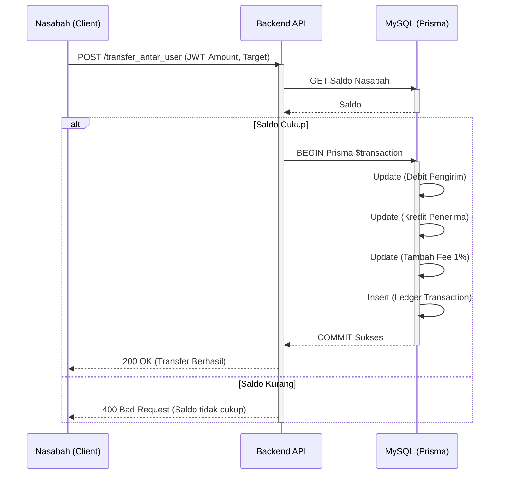
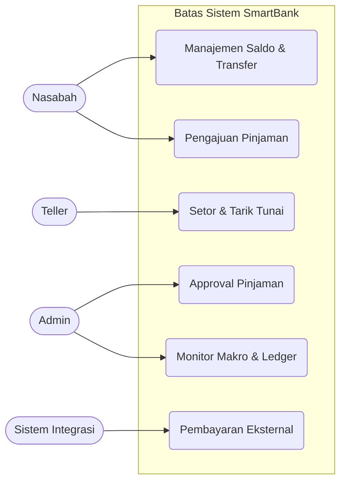

# SOFTWARE REQUIREMENTS SPECIFICATION
**Platform SmartBank (Core Banking System)**

## Atribut Metadata
| Atribut              | Nilai                                                                                                                                                                                                                                      |
| ----------------------| --------------------------------------------------------------------------------------------------------------------------------------------------------------------------------------------------------------------------------------------|
| **Nama Dokumen**     | Software Requirements Specification (SRS) SmartBank                                                                                                                                                                                        |
| **Versi**            | 1.0 - Professional Requirements Baseline                                                                                                                                                                                                   |
| **Tanggal**          | 22 Juni 2026                                                                                                                                                                                                                               |
| **Sistem**           | SmartBank (Core Banking System & Ledger)                                                                                                                                                                                                   |
| **Pemilik Produk**   | Tim Pengembang SmartBank                                                                                                                                                                                                                   |
| **Target Pembaca**   | Product owner, developer, QA engineer, maintainer, dan administrator operasional                                                                                                                                                           |
| **Basis Penyusunan** | SRS ini disusun dari dokumen PRD, DOKUMENTASI.md, serta skema database Prisma (MySQL) dan rancangan fungsional API Node.js (Express). Struktur dokumen mengikuti pola SRS profesional untuk menjamin traceability dan acceptance criteria. |

## 1. Pendahuluan dan Konteks Dokumen
### 1.1 Tujuan Dokumen
Dokumen ini mendefinisikan kebutuhan perangkat lunak untuk aplikasi SmartBank sebagai *Single Source of Truth* (sistem perbankan inti) di dalam ekosistem ekonomi virtual. SRS ini berfungsi sebagai baseline bersama antara pemilik produk dan pengembang untuk memastikan setiap fitur memiliki ruang lingkup yang jelas dan kriteria penerimaan yang dapat diverifikasi.

### 1.2 Ruang Lingkup Produk
SmartBank adalah inti sistem ekonomi yang bertindak sebagai otoritas utama atas seluruh mutasi saldo, transaksi tarik/setor tunai, dan pergerakan uang dalam ekosistem (Closed-Loop System). Aplikasi ini terdiri dari portal Admin, Teller, Nasabah, dan Backend API (Node.js + MySQL). Fungsionalitas mencakup manajemen saldo, transfer uang, pembayaran integrasi, kredit/pinjaman, dan pencatatan ledger.

### 1.3 Out of Scope
| Area | Status Scope | Rasional |
| --- | --- | --- |
| E-Commerce/Marketplace Catalog | Di luar scope | SmartBank murni memproses aliran uang (pembayaran) via API, bukan mengelola produk atau pesanan. |
| Pengiriman Logistik | Di luar scope | Entitas pengiriman ditangani aplikasi terpisah; SmartBank hanya memfasilitasi transaksi pembayaran terkait. |
| Otomatisasi Trading | Di luar scope | Tidak ada fitur bursa saham atau trading otomatis dalam lingkup awal sistem. |

## 2. Gambaran Produk dan Batas Sistem
### 2.1 Product Perspective
Aplikasi SmartBank menempati posisi sentral dalam arsitektur. Backend Node.js (Express) berdiri dengan database MySQL (Prisma ORM) yang menyimpan status moneter global (`system_state`), pengguna (`users`), dan buku besar (`transactions`). Semua portal frontend (Admin, Teller, Nasabah) dan aplikasi eksternal (Marketplace) harus berkomunikasi melalui REST API SmartBank.


*Gambar 1. Konteks sistem dan batas tanggung jawab SmartBank.*

### 2.2 User Classes dan Karakteristik
| User Class | Tanggung Jawab | Ekspektasi Sistem | Kontrol Akses |
| --- | --- | --- | --- |
| **Nasabah** | Mengecek saldo, riwayat mutasi, transfer ke user lain, dan mengajukan pinjaman. | UI mobile-first, transaksi *real-time*, saldo konsisten. | Session JWT via login Nasabah. |
| **Teller** | Melayani setor/tarik tunai nasabah secara fisik dan transfer *walk-in*. | UI pencarian cepat, penghitungan pecahan tunai (*Greedy Algorithm*), urutan mutasi akurat (*Merge Sort*). | Session JWT via login Teller. |
| **Admin** | Memantau makroekonomi (reserve, circulating), menyetujui pinjaman, dan menarik fee. | Visualisasi data (*Chart.js*), pelacakan pencucian uang (*BFS*), dan pencarian ledger cepat (*KMP*). | Session JWT via login Admin. |
| **Sistem Integrasi** | Meminta pemrosesan pembayaran dari user ekosistem (Marketplace dll). | Kontrak API stabil, error deterministik, ACID compliance. | API Key / Token Integrasi. |

### 2.3 Operating Environment
| Komponen | Spesifikasi Saat Ini | Implikasi Requirement |
| --- | --- | --- |
| **Runtime Backend** | Node.js (Express) dengan TypeScript. | Concurrency tinggi dan type-safety pada alur transaksi. |
| **Database** | MySQL 8.0 dengan Prisma ORM. | Memastikan integritas referensial dan pembungkus transaksi (`$transaction`) untuk ACID. |
| **Frontend** | Vanilla JavaScript (SPA), HTML, CSS. | UI ringan dengan manipulasi DOM dan *fetch* asinkron. |

## 3. Konteks Operasional dan Arsitektur
### 3.1 Architectural Overview
Aplikasi menggunakan arsitektur *Client-Server* modern. Backend menyediakan RESTful API JSON. Frontend (Nasabah, Teller, Admin) terpisah dalam folder spesifik yang memanggil endpoint backend. Database MySQL menjadi satu-satunya sumber validitas saldo (Single Source of Truth) yang dilindungi oleh ORM Prisma.

### 3.2 Data Flow
Alur transaksi (misal: Transfer):
1. Client (Nasabah App) memanggil POST `/smartbank/transfer_antar_user` dengan JWT.
2. Backend API memvalidasi token dan saldo pengirim.
3. Transaksi dibungkus Prisma `$transaction` (Double-Entry): Kurangi saldo pengirim, tambah saldo penerima, potong 1% untuk `feeAccumulated`, dan catat riwayat di `transactions`.
4. Jika satu langkah gagal, seluruh query di-rollback.


*Gambar 2. Alur data dan sinkronisasi Single Source of Truth pada transaksi keuangan.*

## 4. Domain Data dan Aturan Bisnis
### 4.1 Core Domain Entities
| Entitas | Deskripsi | Field Penting | Catatan Ownership |
| --- | --- | --- | --- |
| `SystemState` | Status moneter bank (1 row saja). | `totalSupply`, `reserve`, `circulating`, `feeAccumulated` | Hanya Admin yang bisa mengubah manual. |
| `User` | Entitas akun pengguna. | `id`, `name`, `password`, `type`, `balance`, `status` | Dikontrol sepenuhnya oleh SmartBank. |
| `Transaction` | Buku besar (Ledger). | `id`, `type`, `amount`, `source`, `status`, `createdAt` | *Immutable*, tidak boleh dihapus atau diubah setelah *success*. |
| `Loan` | Pengajuan kredit nasabah. | `id`, `userId`, `amount`, `status` | Disetujui/ditolak oleh Admin. |

### 4.2 Business Rules
| ID | Aturan Bisnis | Dampak Implementasi |
| --- | --- | --- |
| BR-01 | **Validasi Keras Reserve 98%** | Cadangan bank (`reserve`) tidak boleh di bawah 98% dari `totalSupply`. Transaksi (pinjaman/setor) yang melanggar batas ini ditolak. |
| BR-02 | **Pajak/Fee Transaksi 1%** | Setiap pemindahan dana antar nasabah otomatis dipotong 1% dan dimasukkan ke `feeAccumulated`. |
| BR-03 | **Single Source of Truth** | Tidak ada update saldo melalui query SQL langsung; wajib melalui API Backend dengan logging Ledger. |
| BR-04 | **Double-Entry Bookkeeping** | Setiap mutasi harus seimbang (Total Uang Beredar + Reserve + Fee = Total Supply). |

## 5. Kebutuhan Fungsional
| ID | Area | Requirement | Priority | Acceptance Criteria |
| --- | --- | --- | --- | --- |
| FR-01 | Authentication | Sistem *shall* menyediakan fungsi registrasi dan login menggunakan JWT untuk akses role. | Must | Token JWT diterbitkan saat login valid; API menolak request tanpa token. |
| FR-02 | Manajemen Saldo | Sistem *shall* menampilkan saldo pengguna secara konsisten dari database `users`. | Must | Endpoint `/smartbank/manajemen_saldo` mengembalikan data balance terbaru. |
| FR-03 | Transfer Antar User | Sistem *shall* dapat memproses perpindahan dana antar dua entitas *User* dengan memotong fee 1%. | Must | Saldo pengirim berkurang (nominal+fee), saldo penerima bertambah (nominal), ledger tercatat. |
| FR-04 | Pembayaran Integrasi | Sistem *shall* menyediakan API pembayaran untuk memproses request dari platform eksternal. | Must | Endpoint menerima parameter harga, memotong saldo user, dan merespon status sukses ke pemanggil. |
| FR-05 | Pinjaman (Loan) | Sistem *shall* memungkinkan pengajuan pinjaman dan pencairan dana jika disetujui Admin. | Must | Status diubah menjadi `approved` oleh Admin; dana pindah dari `reserve` ke `balance` Nasabah jika BR-01 terpenuhi. |
| FR-06 | Tarik & Setor Tunai | Sistem *shall* menyediakan layanan setor/tarik melalui Teller. | Must | Tarik tunai mengimplementasikan *Greedy Algorithm* untuk pecahan kertas; dana kembali ke `reserve`. |
| FR-07 | Pencarian Ledger | Sistem *shall* memungkinkan Admin mencari riwayat ledger dengan performa tinggi. | Should | Pencarian menggunakan algoritma *KMP (Knuth-Morris-Pratt)* di sisi text matching. |
| FR-08 | Visualisasi AML | Sistem *shall* mampu melacak aliran transaksi antar pengguna untuk deteksi dini. | Could | Menggunakan *BFS (Breadth-First Search)* untuk menelusuri graf mutasi keuangan dari target. |

## 6. Kebutuhan Non-Fungsional
| ID | Quality Attribute | Requirement | Verification |
| --- | --- | --- | --- |
| NFR-01 | Data Integrity | Transaksi *shall* mematuhi standar ACID menggunakan database relasional. | Kegagalan di tengah proses tidak menyebabkan saldo terpotong sebelah (rollback sukses). |
| NFR-02 | Concurrency | Sistem *shall* mencegah *race condition* saat user menekan transfer berulang cepat. | Implementasi *Optimistic Locking* pada tabel saldo/transaksi. |
| NFR-03 | Security | Endpoint API *shall* divalidasi dengan RBAC (Role-Based Access Control) dan password *hashed*. | Akun Nasabah tidak dapat memanggil endpoint `/admin/*`. |
| NFR-04 | Maintainability | Backend *shall* ditulis dengan pola MVC/Clean Code. | Controller, Service, dan ORM dipisahkan direktorinya. |

## 7. Antarmuka Eksternal
### 7.1 User Interface Requirements
- **Nasabah App**: Berbasis *Mobile-first*, menampilkan dashboard saldo jelas, tombol kirim uang, dan riwayat di beranda utama.
- **Teller Workspace**: Desain informatif dengan daftar antrean, form penarikan (dengan *Denomination Breakdown* tunai), menggunakan *Merge Sort* untuk menampilkan data riwayat *descending* dengan mulus.
- **Admin Dashboard**: Menggunakan *Glassmorphism* modern, integrasi *Chart.js* untuk grafik komposisi Reserve vs Circulating.

### 7.2 API Requirements & Data Exchange Contract (Contoh JSON)
Endpoint: `POST /smartbank/transfer_antar_user`
**Request Payload:**
```json
{
  "sender_id": "USR-101",
  "receiver_id": "USR-102",
  "amount": 50000
}
```
**Response Sukses (200 OK):**
```json
{
  "status": "success",
  "message": "Transfer berhasil.",
  "data": {
    "transaction_id": "TRX-9981",
    "fee_deducted": 500,
    "sender_balance": 150000
  }
}
```

## 8. Workflow Operasional


*Gambar 3. Use case utama platform SmartBank.*

| Workflow | Trigger | Main Success Scenario | Failure/Control |
| --- | --- | --- | --- |
| Transfer Ekosistem | Nasabah menekan Submit Transfer. | Validasi saldo mencukupi -> Eksekusi db transaction -> Potong 1% fee -> Sukses. | Saldo tidak cukup -> Return error 400. |
| Approval Pinjaman | Admin menekan Approve Loan. | Cek validasi 98% Reserve -> Ubah status loan -> Distribusi dana dari Reserve -> Sukses. | Reserve melanggar 98% limit -> Batalkan approval. |
| API Pembayaran | External App hit `/pembayaran`. | Validasi token -> Pindahkan saldo user ke akun aplikasi tujuan -> Return Receipt JSON. | Timeout/Error validasi -> Transaksi digagalkan. |

## 9. Risiko, Kontrol, dan Acceptance Criteria
| Risk ID | Risiko | Kontrol Wajib | Acceptance Criteria |
| --- | --- | --- | --- |
| R-01 | Hyperinflation (Uang tak terbatas) | Pembatasan keras batas Reserve tidak boleh < 98% Total Supply. | Mencoba approve pinjaman melebihi sisa 2% gagal dengan pesan eksplisit. |
| R-02 | Saldo Ganda (Race Condition) | Penggunaan Optimistic Locking atau fitur transaksi ACID ketat. | Melakukan hit 10x API transfer paralel secara simultan hanya memproses yang sesuai saldo. |
| R-03 | Manipulasi Ledger (Hacker) | Record transaksi bersifat immutable pada level aplikasi. | Tidak ada endpoint PUT/DELETE pada record `transactions`. |

## 10. Matriks Ketertelusuran
| Objective | Requirement IDs | Evidence / Verification |
| --- | --- | --- |
| Transaksi finansial terpusat | FR-02, FR-03, FR-04 | API transfer dapat di-*consume* oleh sistem eksternal dan lokal secara konsisten. |
| Stabilitas Nilai Ekonomi | BR-01, FR-05, R-01 | Pengujian batas 98% reserve lewat *mock* pinjaman besar di Admin panel tertolak. |
| Kepatuhan Core Banking | NFR-01, NFR-02 | Test rollback manual gagal bayar membuktikan tidak ada uang yang menguap. |

## Lampiran: Glosarium
- **Single Source of Truth**: Konsep di mana database SmartBank adalah satu-satunya referensi valid untuk jumlah kekayaan dalam ekosistem.
- **Double-Entry Bookkeeping**: Pencatatan dua arah (Debit dan Kredit) yang membuat saldo sistem selalu imbang.
- **Circulating Supply**: Uang digital yang sedang beredar di dompet nasabah atau entitas.
- **Reserve**: Uang cadangan mutlak milik sistem yang belum/tidak beredar.
- **ACID**: *Atomicity, Consistency, Isolation, Durability* – standar transaksi basis data yang andal.
